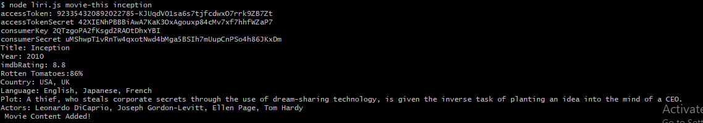

# liri-node-app

Liri Node app is a nodeJS based application which uses npm packages to search songs, follow specifies commands from a file, Get information about movies from OMDB and display your tweets.

Following are the commands and results of liri-node-app:

* Spotify-this-song

* movie-this

* my-tweets

* do-what-it-says- this command looks at the random file and performs the command mentioned there.

* Logging - Every command and result is logged in log.txt

